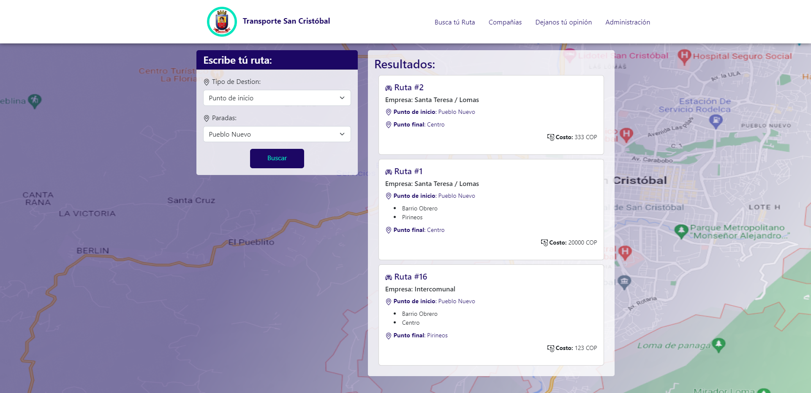
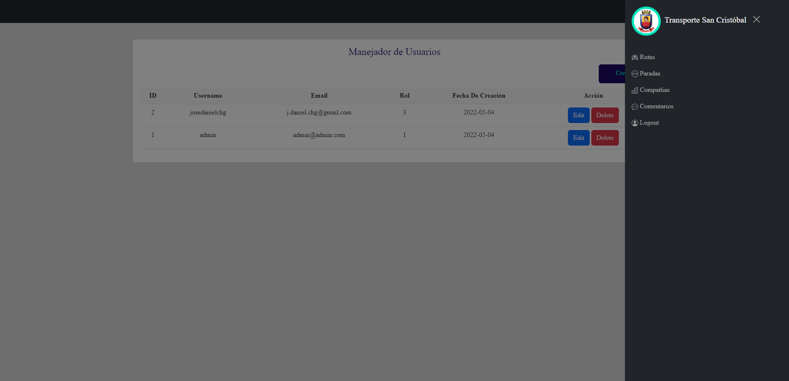

# -- Transporte San Cristóbal --
Es un proyecto universitario construido en PHP vanilla, con estilos CSS básicos. El proyecto permite:
- Crear rutas mediante usuarios adminstrativos.
- Crear usuarios.
- Cualquier visitante puede enviar feedback a través de un formulario.
- Observar la información de las distintas empresas de transporte.
- Observar cuales rutas pasan por le punto que el usuario seleccione.

# -- Instalación del Proyecto --

1) Crear una base de datos cuyo nombre sea "tmsc".
2) Importar dentro de dicha base de datos el archivo SQL que se encuentra en la directorio "/db".
3) Dirigirse a la dirección local que el usuario haya elegido.

# -- Credenciales para el modo administrador --

##### Usuario Administrador de pruebas:
- **Usuario:** admin
- **Clave:** admin123

##### Usuario de la Alcaldía de pruebas:
- **Usuario:** admin
- **Clave:** admin123

##### Usuario Autorizado de pruebas:
- **Usuario:** admin
- **Clave:** admin123

# -- Capturas --

